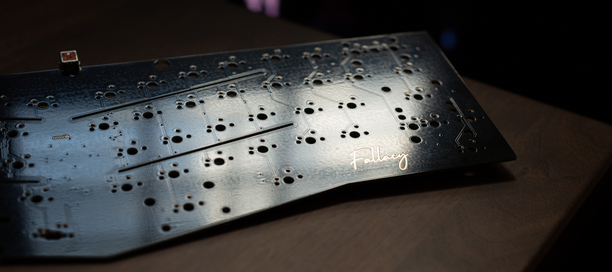

Alice layout keyboard, retaining full compatibility with any TGR Alice PCB, as well as all of its derivatives, clones, and their related accessories. This repo is mainly about the PCB, but I will include some general information about the case as well. 

## PCB features
- QMK / VIA support
- No through-switch LEDs
- Support for the use of fourteen WS2812B RGB-LEDs, if backlight is desired.
- Layout options:
    - Stepped/normal caps
    - Split/fullsized backspace
    - Split/fullsized Rightshift
- top mounted mini-USB

## Case features

- General information can be found on [geekhack](https://geekhack.org/index.php?topic=103728.0)
- Fully compatible with all Alice PCBs and plates. (Top mounted mini-USB)
- Top Mount
- Anodized 5052 Aluminum for the Top and Bottom Case
- Sandblasted Brass Weight
- 6.5 Degree Typing Angle
- 16.5mm Front Typing Height
- USB Mini port
- PCB Compatible With QMK
- PCB features flex cuts
- Brass weight spans the entirety of the alpha cluster
- Side cutouts for grip
- Aluminum/Brass/POM plate
- Designed by esheu2
